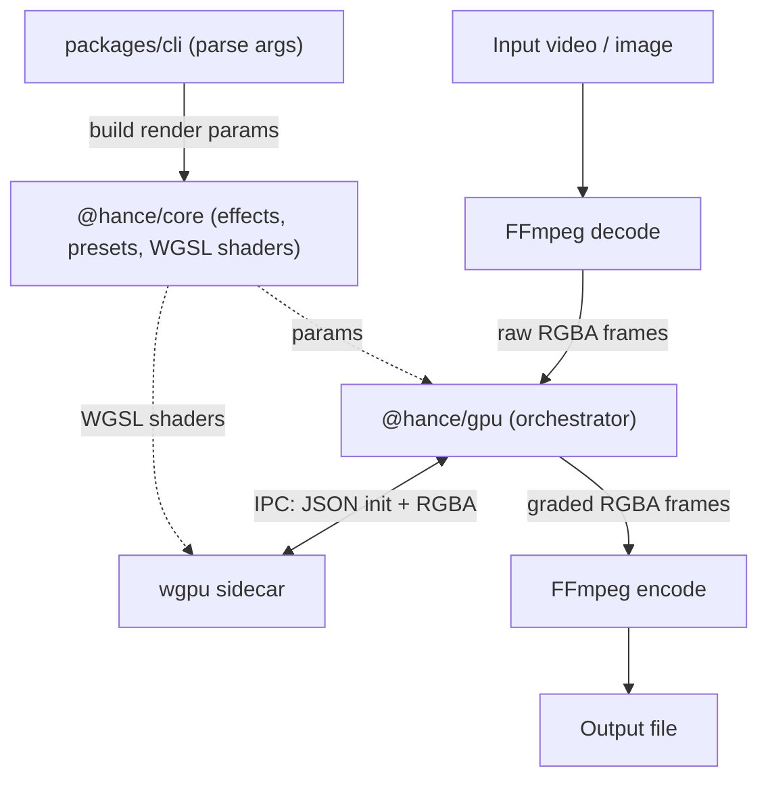
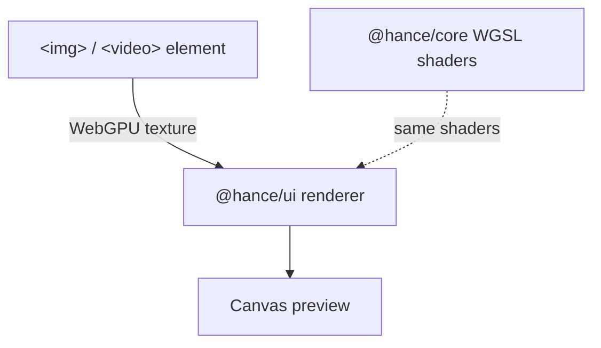

Hance is a Bun workspaces monorepo with five packages:

| Package | Purpose |
|---------|---------|
| `packages/core` | Pure TypeScript effect/preset/arg logic and the shared WGSL shaders |
| `packages/cli` | The compiled `hance` binary entry point |
| `packages/gpu` | Render orchestration: drives the sidecar, runs the image pipeline, handles export |
| `packages/ui` | Browser-based interactive preview |
| `packages/wgpu` | Rust wgpu sidecar binary |

## How a frame flows (CLI render)

When you render from the CLI, hance is not a pure-GPU tool: FFmpeg handles the codec work at both ends, and the GPU handles the pixels in between. `@hance/gpu` orchestrates the round trip for both video and image inputs.

## How a frame flows (browser UI preview)

The browser UI preview is a separate path. It loads the media into an `` or `<video>` element and uploads it straight into a WebGPU texture, so previewing an image never touches FFmpeg. Crucially it loads the **same `@hance/core` WGSL shaders** as the CLI sidecar, so the preview matches the final render.

## GPU rendering

Effects are rendered on the GPU via the native Rust [wgpu](https://wgpu.rs) sidecar. The WGSL shaders in `packages/core` are shared between the browser preview and the Rust sidecar, so what you see in `hance ui` is exactly what you get from the CLI.

## IPC protocol

The sidecar communicates with the Bun process over stdin/stdout using a length-prefixed JSON init message followed by raw RGBA frames. This keeps the orchestration lightweight while offloading pixel work to the GPU.

## Codec I/O

`@hance/gpu` shells out to FFmpeg to decode the input into raw RGBA frames (`-f rawvideo -pix_fmt rgba`) and to encode the processed frames back into the output container. `ffmpeg` and `ffprobe` must be on your `PATH`. The GPU work happens entirely between decode and encode, so there are no intermediate files.

## Processing pipeline

Every file passes through the same effect chain:

1. Input LUT (log → Rec.709 conversion, e.g. V-Log, skipped unless set)
2. Color grading (exposure, contrast, white balance, saturation, fade)
3. Halation (highlight glow)
4. Chromatic aberration (lens fringing)
5. Bloom (soft light diffusion)
6. Film grain
7. Vignette
8. Split toning
9. Camera shake

The optical effects (halation, chromatic aberration, bloom, grain, and vignette) run in **linear light** (the chain is bracketed by sRGB↔linear conversions, with 16-bit float intermediates) so glows and blurs spread physically correct energy. Color grading, split toning, and camera shake stay in perceptual (gamma) space.

All effects compose into a single GPU render graph, with no intermediate files and no re-encoding chains.
